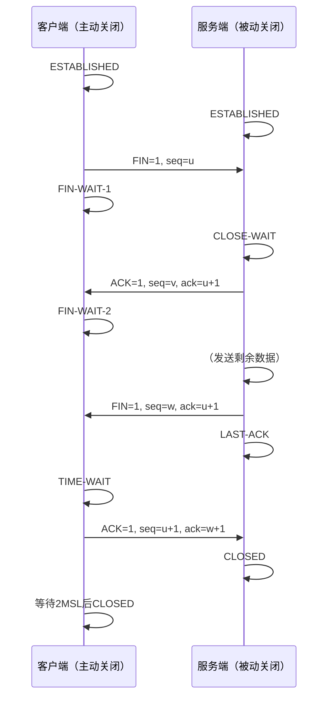

# TCP四次挥手详解

## 1. 什么是四次挥手

TCP 是面向连接的、可靠的传输层协议。当通信双方完成数据交换后，需要断开连接以释放资源。由于 TCP 连接是**全双工**的，每个方向必须单独关闭，因此断开连接需要四次交互，这就是“四次挥手”。

------

## 2. 记忆方法

### 2.1 挂电话比喻

把客户端和服务端想象成通话的两个人：

1. **客户端**： “我有事要挂了。” （发送 FIN）
2. **服务端**： “我知道了，你等一下，我还有最后几句话要说。” （回复 ACK，进入半关闭）
3. **服务端**： “我说完了，现在真的可以挂了。” （发送 FIN）
4. **客户端**： “好的，那我挂电话了。过一会儿再彻底断开。” （回复 ACK，等待 2MSL 后关闭）

### 2.2 四字口诀

**“关 1 收 2 关 3 等 4”**

- **关**：主动方发 FIN（关闭请求）
- **收**：被动方收 FIN，回 ACK（确认）
- **关**：被动方发 FIN（关闭自己方向）
- **等**：主动方回 ACK，并进入 TIME-WAIT（等待 2MSL）

------

## 3. 四次挥手详细过程

假设客户端主动关闭连接，服务端被动关闭。
（**seq** 表示序列号，**ack** 表示确认号，FIN 包会消耗一个序列号）

### 步骤 1：客户端发送 FIN

- **客户端** → **服务端**：`FIN=1, seq=u`
- 客户端进入 **FIN-WAIT-1** 状态，不再发送数据，但可以接收数据。
- 服务端收到后进入 **CLOSE-WAIT** 状态。

### 步骤 2：服务端回复 ACK

- **服务端** → **客户端**：`ACK=1, seq=v, ack=u+1`
- 客户端收到后进入 **FIN-WAIT-2** 状态，等待服务端的 FIN。
- 此时连接处于半关闭状态：服务端可能还在发送未传完的数据。

### 步骤 3：服务端发送 FIN

- 服务端数据发送完毕，向客户端发送 FIN：
  - **服务端** → **客户端**：`FIN=1, seq=w, ack=u+1`（ACK 可能携带最后一次数据的确认）
- 服务端进入 **LAST-ACK** 状态，等待客户端的最终确认。

### 步骤 4：客户端回复 ACK 并等待

- **客户端** → **服务端**：`ACK=1, seq=u+1, ack=w+1`
- 客户端进入 **TIME-WAIT** 状态，等待 2MSL（Maximum Segment Lifetime，最大报文段生存时间）后才关闭。
- 服务端收到 ACK 后立即关闭连接，进入 **CLOSED** 状态。
- 客户端等待 2MSL 后也进入 **CLOSED**。

### 状态迁移图




------

## 4. 为什么是四次而不是三次？

因为 TCP 是全双工协议，两个方向的关闭必须独立进行。

- 第一次挥手关闭客户端到服务端的数据传输。
- 第二次挥手仅表示服务端收到了关闭请求，但服务端可能还有数据要发，所以不能立即关闭自己的发送通道。
- 第三次挥手才关闭服务端到客户端的数据传输。
- 第四次挥手是客户端的最终确认。

若服务端收到 FIN 后没有数据要发，理论上可以将 ACK 和 FIN 合并发送，此时变成三次挥手（延迟确认机制可能导致合并），但标准流程仍按四次理解。

------

## 5. 在 Linux 问题排查中的使用场景

掌握四次挥手有助于分析网络连接异常、性能瓶颈和应用程序 Bug。以下是常见场景及排查方法。

### 5.1 大量 TIME_WAIT 连接

**现象**：`netstat -n | grep TIME_WAIT | wc -l` 数值巨大（成千上万）。
**原因**：主动关闭方（通常是客户端）频繁建立短连接，每个连接关闭后进入 TIME_WAIT，占用端口和内存。
**影响**：

- 端口耗尽（如果客户端作为请求方）。
- 新建连接可能失败（端口不足或超过 `tcp_max_tw_buckets`）。

**排查命令**：

bash

```
ss -tan state time-wait | wc -l
```


**优化方案**（内核参数）：

bash

```
# 查看当前 TIME_WAIT 数量
sysctl net.ipv4.tcp_max_tw_buckets

# 允许将 TIME_WAIT 连接用于新连接（需配合 tcp_timestamps）
echo 1 > /proc/sys/net/ipv4/tcp_tw_reuse
echo 1 > /proc/sys/net/ipv4/tcp_timestamps

# 减小 TIME_WAIT 超时时间（默认60秒，谨慎调整）
echo 30 > /proc/sys/net/ipv4/tcp_fin_timeout

# 限制 TIME_WAIT 总数，超过则直接释放
echo 20000 > /proc/sys/net/ipv4/tcp_max_tw_buckets
```


> **注意**：`tcp_tw_recycle` 已在现代内核中移除，不再使用。

### 5.2 大量 CLOSE_WAIT 连接

**现象**：`ss -tan state close-wait` 或 `netstat -n | grep CLOSE_WAIT` 显示大量连接处于 CLOSE_WAIT。
**原因**：被动关闭方的应用程序未正确关闭 socket（未调用 `close()`），导致连接挂起。
**影响**：文件描述符泄漏，最终 `too many open files`，服务不可用。
**排查命令**：

bash

```
# 查看哪些进程持有 CLOSE_WAIT 连接
ss -tanp state close-wait

# 或使用 netstat
netstat -tnp | grep CLOSE_WAIT

# 查看进程打开的文件数
lsof -p <PID> | wc -l
```


**解决方案**：修复应用程序代码，确保在数据读取完毕后调用 `close()` 或 `shutdown()`。

### 5.3 连接卡在 FIN_WAIT1 或 FIN_WAIT2

**现象**：`ss -tan state fin-wait-1` 或 `ss -tan state fin-wait-2` 长时间存在。
**原因**：

- **FIN_WAIT1**：主动关闭方发送 FIN 后未收到 ACK（网络丢包、对端无响应）。
- **FIN_WAIT2**：已收到 ACK，但未收到对端的 FIN（对端程序未关闭连接，或 FIN 包丢失）。
  **排查**：

bash

```
# 抓包分析是否重传
tcpdump -i eth0 host <目标IP> and port <端口>

# 调整超时参数
sysctl net.ipv4.tcp_fin_timeout   # FIN_WAIT2 超时，默认60秒
sysctl net.ipv4.tcp_orphan_retries  # FIN_WAIT1 重传次数
```


### 5.4 大量 LAST_ACK 连接

**现象**：`ss -tan state last-ack` 过多。
**原因**：被动关闭方发送 FIN 后，未收到客户端的最终 ACK（可能是客户端崩溃或网络问题）。
**影响**：占用系统资源，可能导致服务端无法及时关闭连接。
**排查**：

- 检查客户端是否存活，网络是否可达。
- 抓包查看是否有 FIN 重传。
- 调整 `tcp_orphan_retries` 减少重传次数。

### 5.5 抓包分析挥手过程

当怀疑连接异常关闭导致数据丢失或挂起时，可用 `tcpdump` 捕获交互包：

bash

```
tcpdump -i eth0 -w handshake.pcap host 10.0.0.1 and port 8080
```


然后用 Wireshark 打开，过滤 `tcp.flags.fin == 1` 或 `tcp.flags.reset == 1`，观察是否有丢包、重传或 RST 异常。

### 5.6 监控连接状态评估应用健康

在运维监控中，定期统计各状态连接数：

bash

```
ss -tan | awk '{print $1}' | sort | uniq -c
```


若 `CLOSE_WAIT`、`FIN_WAIT1` 持续增长，应触发告警。

------

## 6. 高并发短连接场景调优

对于高并发短连接服务（如反向代理、Web 服务器），主动关闭方可能积累大量 TIME_WAIT，可采取以下优化：

- **开启 `tcp_tw_reuse`**：允许内核将 TIME_WAIT 连接用于新的出站连接（需同时开启 `tcp_timestamps`）。
- **增大端口范围**：`net.ipv4.ip_local_port_range`，避免端口耗尽。
- **使用长连接**：在应用层启用 Keep-Alive，减少连接建立/关闭次数。
- **调整 `tcp_max_tw_buckets`**：限制 TIME_WAIT 总数，超过后立即释放，但可能导致 ACK 丢失（极少见）。
- **若作为服务端，避免主动关闭**：尽量由客户端主动关闭连接，将 TIME_WAIT 分散到客户端。

------

## 7. 总结

- 四次挥手是 TCP 断开连接的规范流程，理解其状态变化对排查网络问题至关重要。
- 常见的异常状态（TIME_WAIT、CLOSE_WAIT、FIN_WAIT1/2、LAST_ACK）往往对应不同的系统或应用问题。
- 通过 `ss`、`netstat`、`tcpdump` 等工具，结合内核参数调优，可以有效诊断和优化连接关闭相关的性能瓶颈。